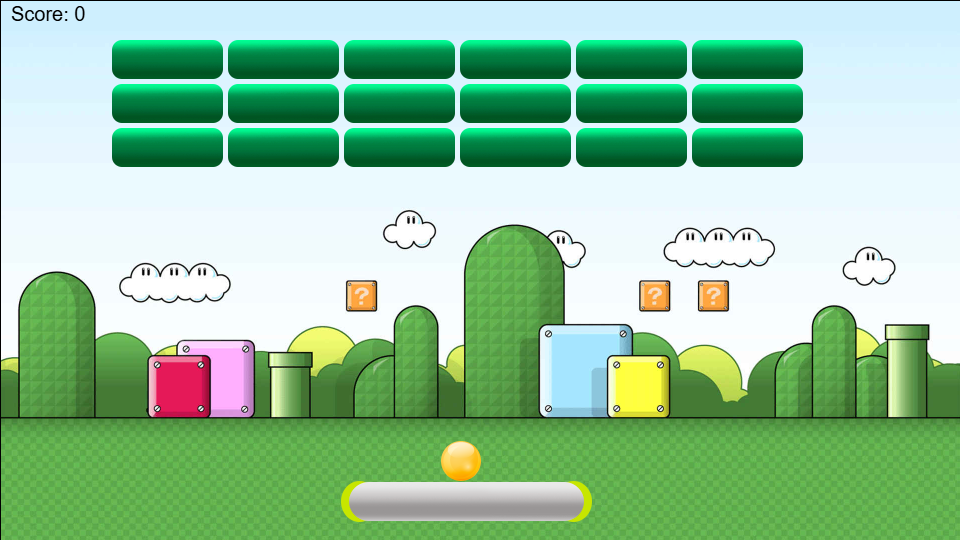

# Arkanoid Canvas JS Game

Simple Arkanoid-style browser game built with HTML5 Canvas and vanilla JavaScript. The project demonstrates a lightweight game loop, sprite rendering, keyboard controls, collision detection, and audio feedback.

## Features
- Keyboard controls: `SPACE` to launch the ball, `LEFT` and `RIGHT` to move the platform
- HTML5 Canvas rendering with sprite-based game objects for ball, paddle, and bricks
- Core arcade gameplay loop with collision detection for blocks, platform, and world bounds
- Score tracking and win/lose flow with sound effects for bounce, block hit, and game over
- Modular entity structure with separate JavaScript components for ball, platform, block, and game logic

## Tech Stack
- HTML5 Canvas API
- Vanilla JavaScript
- CSS for layout and canvas styling
- Static asset loading for PNG sprites and MP3 audio

## Screenshots / Demo


## Installation
1. Clone or download the repository
2. Open `index.html` in a modern browser

Alternative local server option:
```bash
cd arkanoid-canvas-js-game
python -m http.server 8000
```
Then open `http://localhost:8000`.

## Project Purpose
This repository is an experimental game prototype created to practice browser-based game development fundamentals, including the render loop, collision handling, and input-driven gameplay.

## Notes
- The project is intentionally simple and built without a frontend framework.
- It is a strong foundation for adding levels, responsive controls, and modern asset management.

